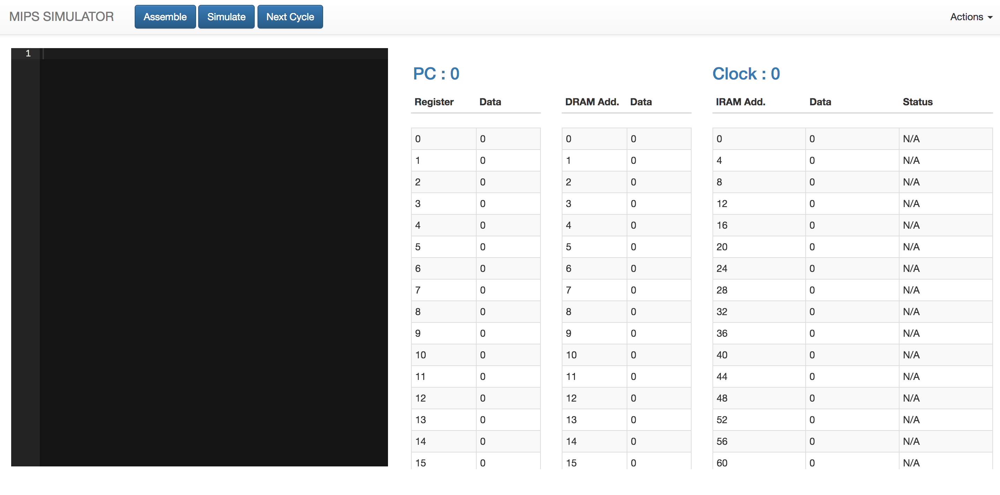

# R400-Advanced-MIPS-CPU-Simulator

This is an 8 Stage MIPS Pipelined CPU with the following features

* Developed in HTML and javascript
* Works on technically any browser
* Uses dynamic branch prediction using a BTB
* Contains an assembler that assembles code written in the text editor
* Clock Cycle monitoring
* Display of registers, memory and current Program Counter in each clock cycle
* Display the current stage for each instruction while execution
